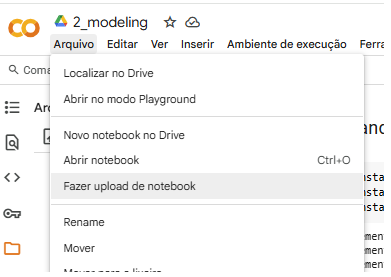
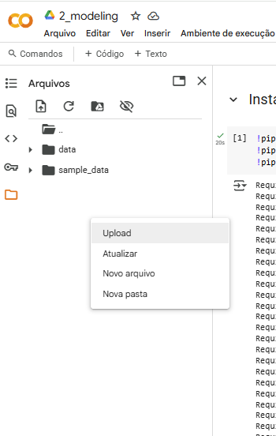

## Ifood-Case

Repositório contém dados e o código referente ao desafio de seleção de ofertas para clientes do Ifood.

Candidata: Polyana Bezerra da Costa

## Instruções para reprodução dos experimentos

A pasta notebooks/ contém dois arquivos:
1_data_processing.ipynb: processamento e análise exploratória dos dados que estão em data/raw/ e a geração de um dataset processado que fica em data/processed/
2_modeling.ipynb: treinamento e teste de vários modelos de classificação binária, resultados finais e considerações

Ambos os notebooks foram desenvolvidos e executados no Google Colab. Link para o Google Colab: <https://colab.google/>. Preferi usar o Colab por ser prático e por já ter suporte ao Spark.
Inicialmente, tentei usar o Databricks, mas a versão Community apresentou problemas com clusters que demoravam muito para inicializar (ou nunca ligavam), por isso eu não tinha recurso para rodar os notebooks.

Para executar o notebook '1_data_processing' no Colab, basta fazer o upload do notebook para o Colab, como mostra a figura 1 e dos arquivos que estão na pasta data/raw/ pra área de 'Arquivos' do Colab, como mostra a Figura 2. O ideal é criar essa estrutura de pastas dentro do Colab -> data/raw/ e nessa pasta, colocar os arquivos offers.json, profile.json e transactions.json. Se não quiser colocar esses arquivos dentro de pastas, não tem problema, só mudar o caminho pros arquivos nas células 3, 4 e 5 do notebook 1.

Como alternativa, também compartilho o link do notebook no Colab, para que você só precise fazer o upload dos dados. Link pro notebook 1: <https://colab.research.google.com/drive/1eLQpupcjsy9iVxktk11XFArlCe4F-iMB?usp=sharing>

Ao executar esse notebook, ele faz o processamento e junção dos dados raw, gerando arquivos do tipo parquet com os dados processados. Eu salvei esses arquivos em três pastas diferentes: data/processed/offers/ para colocar os dados referene somente às ofertas, data/processed/profile/, para ter só dados relacionados aos perfis dos usuários e data/processed/offers_profile/, que tem um arquivo unificado para as transações e interações dos usuários com as ofertas. Você não precisa salvar nesse caminho específico, é só mudar na célula 71. Os dados gerados nessa etapa são usados no notebook 2.

O notebook '2_modeling' carrega os arquivos parquet gerados na etapa anterior, então certifique-se de fazer o upload dos arquivos que estão na pasta data/processed/. Para fazer o upload desse notebook e dos arquivos necessários, basta seguir a explicação dada no parágrafo 3. Também compartilho o link desse notebook no Colab, para que você só precise fazer o upload dos dados. Link pro notebook 2: <https://colab.research.google.com/drive/1-EGmiPuVP16XL9K_890H8qDzhtZoGbw-?usp=sharing>.

Qualquer dúvida, entrar em contato com: polyanabcosta@gmail.com.
